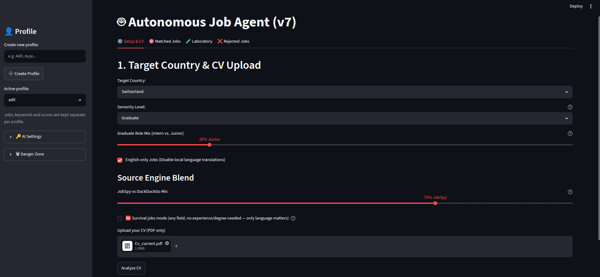
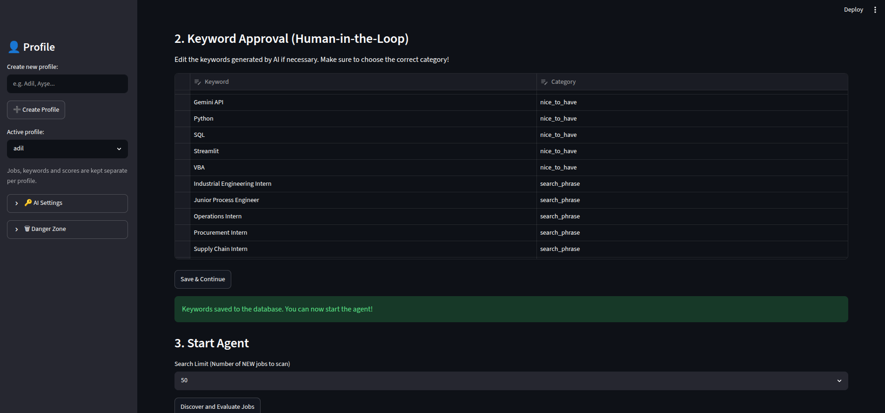
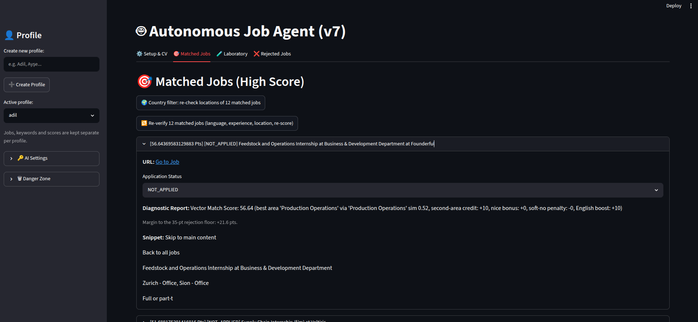
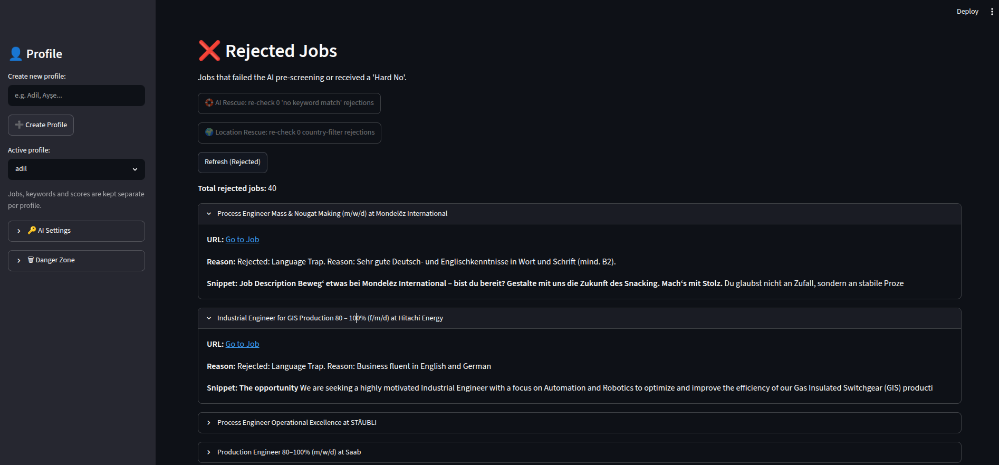

# AI-Job-Scraper 🤖

An autonomous, AI-driven job discovery engine built with Python, Streamlit, and Google Gemini. 

> **Built with AI Assistance:** Developed with AI-assisted coding tools (**Claude, Gemini, and Kimi**); architecture, requirements, and validation by me.

> **⚠️ Disclaimer:** This project was originally built for personal use. Some features might occasionally break or return suboptimal results due to changes in job boards or rate limits. If you encounter any bugs or non-optimal results, feel free to open an issue with a screenshot, or reach out to me directly at my GitHub profile!
Unlike standard keyword scrapers that flood you with irrelevant jobs, this agent uses **Semantic AI Pre-Screening** to read your CV, dynamically compose optimal search phrases, aggressively scrape the entire internet for matches, and then grade every single job against your exact qualifications.

## 📸 Screenshots
<p align="center">
  
  
</p>
<p align="center">
  
  
</p>

## ✨ Key Features

1. **AI-Driven Search Matrix:**
   - Upload your PDF CV, and the Gemini 2.5 Flash model instantly extracts your core skills, nice-to-haves, and hard limits (e.g., "no Senior roles").
   - It mathematically generates a highly specific Cartesian search matrix combining AI-generated Job Titles and Country Synonyms (e.g., `["Data Analyst", "Data Scientist"]` × `["Switzerland", "Schweiz", "Suisse"]`), and attaches dynamic seniority exclusions.

2. **Interleaved Dual-Engine Scraping:**
   - **JobSpy Engine:** Aggressively overfetches high-quality listings directly from native boards (LinkedIn, Indeed, Glassdoor).
   - **DuckDuckGo Engine:** Acts as a heat-seeking fallback to scrape the open web, catching obscure aggregators and direct company career pages (Workday, Lever) that native boards miss.
   - **Custom Source Blend:** Includes a UI slider to mathematically allocate search bandwidth between JobSpy and DuckDuckGo.

3. **Multi-Stage Filtering Pipeline:**
   - **Deduplication:** A local SQLite database tracks URL hashes and SimHash text structures to ensure you never see the same job twice.
   - **Entry-Level Trap Gates:** Automatically detects and rejects "fake" Junior jobs that secretly demand 5+ years of experience in the description body.
   - **AI Relevance Pre-Screening:** The LLM reads the full description of every deduplicated job and assigns a score out of 100 based *only* on your CV's Must-Haves.

4. **Dynamic Streamlit UI:**
   - Human-in-the-loop keyword editing.
   - Interactive circuit breakers and CAPTCHA warnings *(Note: The manual CAPTCHA rescue feature only applies to Google searches and is currently untested in the wild).*
   - Real-time terminal output mirroring in the UI.
   - Beautiful metric dashboards for Matched, Rejected, and pending jobs.

---

## 🚀 Setup Instructions

### 1. Clone the Repository
```bash
git clone https://github.com/454theasa/AI-Job-Scraper.git
cd AI-Job-Scraper
```

### 2. Create a Virtual Environment
It is highly recommended to run this project inside a clean virtual environment to avoid dependency conflicts.
```bash
# Create the virtual environment
python3 -m venv venv

# Activate it (Linux/Mac)
source venv/bin/activate
# Activate it (Windows)
venv\Scripts\activate
```

### 3. Install Dependencies
```bash
pip install -r requirements.txt
```

### 4. Configure API Keys
You **do not** need to mess with `.env` files or hardcode anything! 
Once you launch the app, simply open the sidebar and enter your Google Gemini API key securely in the **🔑 AI Settings** menu. It will be saved locally to your database.
*(You can get a free Gemini API key from Google AI Studio).*

**Supported AI Models:**
Because the scraper relies on strict structured JSON validation, it natively supports Google's modern models. You can specify any of these in the UI settings:
- `gemini-2.5-flash` *(Default: Fastest and best for the free tier)*
- `gemini-2.5-pro` *(Smartest, but consumes rate limits faster)*
- `gemini-1.5-flash` or `gemini-1.5-flash-8b`

### 5. Launch the Agent!
```bash
streamlit run app.py
```
The UI will automatically open in your web browser.

---

## 🧠 Architecture Highlights

- **Database:** Local SQLite + SQLModel (ACID compliant, zero-config).
- **Concurrency:** Uses a background thread worker so the Streamlit UI never freezes during heavy 30-minute scrape sessions.
- **Resilience:** Built-in circuit breakers and backoff logic to prevent IP bans during aggressive search iterations.

## 🤝 Contributing
Feel free to open an issue or submit a pull request if you have ideas on how to improve the matching algorithm or add new scraping engines!
